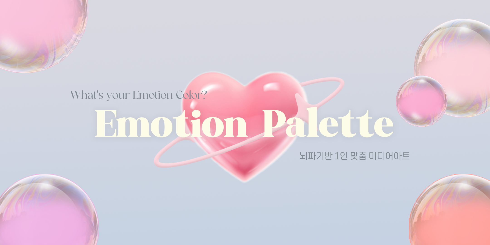
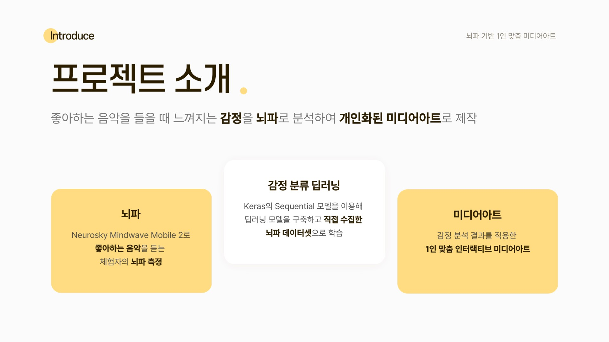

# 💗Emotion Palette

 
 

## 🎥 프로젝트 설명

 
 

 

# 📝 기능 소개

 
 

# 🏆 기술 스택
## Programming language

 
 

## Development Tool & Framework
 
 

## Database

 

 

## Source Code Management
 
 

## Communication Tool

  

 
 
 

